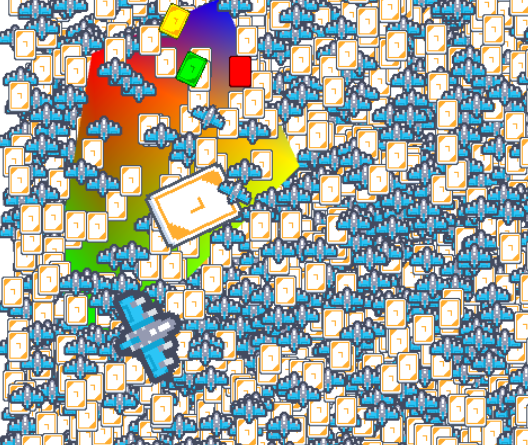

# 🚀 Rapid.js

A highly efficient and lightweight WebGL renderer capable of rendering 10k sprites at 60fps.


[demo](https://nightre.github.io/Rapid.js/demo/) ( [source code](./demo/index.js) )

# Features:
* Fast rendering ( capable of rendering 10,000 sprites at 60fps )
* Multi-texture support ( Batch rendering based on the GPU's maximum texture units )
* Texture cropping
* Graphic
* Matrix stacking
* Color

# Install

```
npm i rapid-render
```

Or use unpkg

```html
<script src="https://unpkg.com/rapid-render/dist/rapid.umd.cjs"></script>
```

# Import

```js
import { Rapid } from "rapid-render"
```

# Useage

```js
let rapid = new Rapid({
    canvas: document.getElementById("game"),
    backgroundColor: Color.fromHex("FFFFFF")
})

// Creating textures
const cat = await rapid.texture.textureFromUrl("./cat.png")
const plane = await rapid.texture.textureFromUrl("./plane.png")
// or
// Texture.fromImageSource(img)
// Texture.fromUrl(url)
// set clip
cat.setClipRegion(
    10,10 // top-left corner of the clipped region.
    50,50 // size
)
//                      R   G   B   A
const color = new Color(255,255,255,255)
// or Color.fromHex
// Called before starting rendering
rapid.startRender()


rapid.save() // Save state
rapid.matrixStack.translate(0,0)
rapid.matrixStack.scale(1)
rapid.matrixStack.rotate(0)

//               texture offset color
rapid.renderSprite(cat,0,0, color) // draw Sprite
rapid.restore() // back to the previous saved state

// draw graphic
// Different vertices can have different colors
rapid.startGraphicDraw()
rapid.addGraphicVertex(0, 0, color)
rapid.addGraphicVertex(100, 0, color)
rapid.addGraphicVertex(100, 100, color)
rapid.endGraphicDraw()

// Called after rendering
rapid.endRender()

// set the size
rapid.resize(100,100)
```

# Screen Shot


