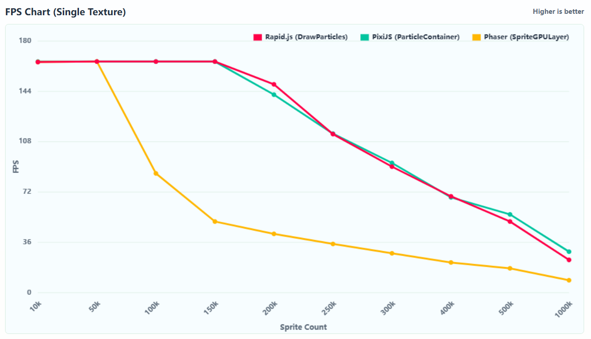

<p align="center">
  
</p>

<p align="center">
  A stateless, high-performance WebGL 2D renderer for browser games.
</p>

<p align="center">
  <a href="https://nightre.github.io/Rapid.js/">Website</a>
  &middot;
  <a href="https://nightre.github.io/Rapid.js/docs.html">Docs</a>
  &middot;
  <a href="https://nightre.github.io/Rapid.js/api/">API Reference</a>
</p>

---

## What is Rapid?

Rapid is a focused WebGL 2D rendering engine for games and visual tools. lightweight at just **67 kB** (**~19.5 kB gzipped**) It handles the rendering layer while leaving your game architecture, update loop, and state management fully in your hands.

> The documentation and demos are still being written.

## Highlights

- **Automatic batching**  
  Rapid automatically batches compatible draw work. Multi-texture batching binds different textures into a single draw call, eliminating manual grouping.

- **Powerful custom shaders**  
  Add sprite and geometry effects through shader hooks while still using Rapid's normal renderer, transforms, textures, and draw APIs.

- **Flexible transforms**  
  Compose motion, hierarchy, camera behavior, and local drawing with multiple transform styles backed by a fast matrix engine.

- **A complete 2D toolkit**  
  Draw sprites, lines, masks, particles, render textures, text, and custom geometry from one compact WebGL renderer.

## Install

```bash
npm install rapid-render
```

## Quick Start

```ts
import { Rapid, Color } from "rapid-render";

const canvas = document.querySelector("canvas")!;
const rapid = new Rapid({canvas});

rapid.clear();
rapid.drawRect({
   x: 40,
   y: 40,
   width: 160,
   height: 96,
   color: new Color(84, 184, 234),
});
rapid.flush();
```

## Benchmark

Performance Comparison: Rapid vs. Other Renderers and Game Engines

<p align="center">
  <a href="https://nightre.github.io/Rapid.js/benchmark/">
    
    
  </a>
</p>

<p align="center">
  🎮 <strong><a href="https://nightre.github.io/Rapid.js/benchmark/">Run Interactive Benchmark Live &rarr;</a></strong>
</p>

Tested on **Windows 11 / Intel i7-12850H / NVIDIA RTX 4070 Laptop GPU / Google Chrome (WebGL 2.0)** (Chrome / WebGL 2.0)

## Who is using Rapid.js?

We'd love to feature your work! Submit a Pull Request or Open an Issue to add your project to the showcase.

<table>
  <tr>
    <td width="96" valign="top">
      <a href="https://www.instagram.com/p/DJboaWgMzhK/?img_index=3">
        
      </a>
    </td>
    <td valign="top">
      <strong><a href="https://www.instagram.com/p/DJboaWgMzhK/?img_index=3">Avoid the Zeros</a></strong><br>
      Foxdog Studios used Rapid.js to deliver fast download times and smooth multi-sprite rendering for thousands of audience members playing simultaneously on their mobile phones at the <strong>Sydney Opera House</strong>.<br>
      <sub><strong>Foxdog Studios</sub>
    </td>
  </tr>
  <tr>
    <td width="96" valign="top">
      <a href="https://poki.com/zh/g/emoji-party">
        
      </a>
    </td>
    <td valign="top">
      <strong><a href="https://poki.com/zh/g/emoji-party">Emoji Party</a></strong><br>
      A featured puzzle hit on Poki with over <strong>13,000+ player ratings</strong>. Rapid.js powers its snappy sprite animations and instant-play experience across hundreds of thousands of diverse mobile and desktop browsers.<br>
      <sub><strong>illusivegames</sub>
    </td>
  </tr>
</table>

## Contributing

Contributions, issues, and feature requests are welcome!

Before submitting a Pull Request, please ensure:
- **Strict TypeScript (Zero any)**: All code must pass strict type checking with zero `any`, loose casts, or `@ts-ignore` directives.
- **Passing Checks**: Run `npm run build` to ensure clean compilation with zero warnings or errors.
