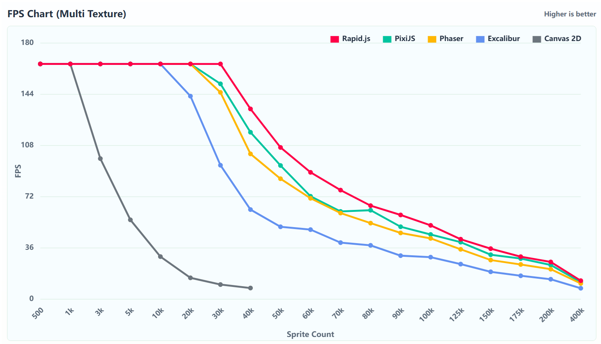

<p align="center">
  
</p>

<p align="center">
  A Immediate-mode, high-performance WebGL 2D renderer for browser games.
</p>

<p align="center">
  <a href="https://nightre.github.io/Rapid.js/">Website</a>
  |
  <a href="https://nightre.github.io/Rapid.js/docs.html">Docs</a>
  |
  <a href="https://nightre.github.io/Rapid.js/api/">API Reference</a>
  |
  <a href="https://www.npmjs.com/package/rapid-render">NPM</a>
</p>

---

## What is Rapid?

Rapid is a focused WebGL 2D rendering engine for games and visual tools. lightweight at just **69 kB** (**~20 kB gzipped**) It handles the rendering layer while leaving your game architecture, update loop, and state management fully in your hands.

## Highlights

- **Rendering speed**  
  An efficient batching system significantly reduces draw calls, allowing Rapid.js to maintain smooth, stable performance even when rendering large numbers of sprites at once.

- **Powerful custom shaders**  
  Add sprite and geometry effects through shader hooks while still using Rapid's normal renderer, transforms, textures, and draw APIs.

- **Flexible transforms**  
  Fast, flexible, matrix-powered transforms for motion and hierarchies. Retain the matrix tree after traversal; local changes update only affected subtrees. No rebuild required.

- **A complete 2D toolkit**  
  Draw sprites, lines, masks, particles, render textures, text, and custom geometry from one compact WebGL renderer.

## Install

```bash
npm install rapid-render
```

## Quick Start

```ts
import { Rapid, Color } from "rapid-render";

const canvas = document.querySelector("canvas")!;
const rapid = new Rapid({canvas});

rapid.clear();
rapid.drawRect({
   x: 40,
   y: 40,
   width: 160,
   height: 96,
   color: new Color(84, 184, 234),
});
rapid.flush();
```
## Render a scene

Rapid.js retains every matrix created in the MatrixStack, even after it has been popped, so you can use it for rendering or modify it later. For more information about matrix transformations, see the [Transformations](https://nightre.github.io/Rapid.js/docs.html#transformations).

```ts
// root
// ├── world
// │   ├── player
// │   └── enemies
// │       ├── enemy #0
// │       ├── enemy #1
// │       └── ...
// └── ui

const stack = rapid.matrixStack;
// 1.root
stack.save();
    stack.translate(0, 0);
    // 2.world
    stack.save();
        rapid.drawSprite(player); // player
        // 3.enemies
        stack.save();
            for (let i = 0; i < 2; i++) {
                stack.translate(x, y);
                rapid.drawSprite(enemies[i]); // enemy
            }
        stack.restore(); // 3.enemies
    stack.restore(); // 2.world
stack.restore(); // 1.root
// ui
rapid.drawSprite(ui);
```
Next step: <a href="https://nightre.github.io/Rapid.js/docs.html">Docs</a>

## Benchmark

Performance Comparison: Rapid vs. Other Renderers and Game Engines

<p align="center">
  <a href="https://nightre.github.io/Rapid.js/benchmark/">
    
  </a>
</p>

[Run Interactive Benchmark Live](https://nightre.github.io/Rapid.js/benchmark/)

Tested on **Windows 11 / Intel i7-12850H / NVIDIA RTX 4070 Laptop GPU / Google Chrome (WebGL 2.0)**

## Who is using Rapid.js?

We'd love to feature your work! Please [**Submit a Pull Request**](https://github.com/Nightre/Rapid.js/pulls) or tell nightscratch1145@gmail.com to add your game or app to the showcase!
<table>
  <tr>
    <td width="96" valign="top">
      <a href="https://www.instagram.com/p/DJboaWgMzhK/?img_index=3">
        
      </a>
    </td>
    <td valign="top">
      <strong><a href="https://www.instagram.com/p/DJboaWgMzhK/?img_index=3">Avoid the Zeros</a> by Foxdog Studios</strong><br>
      Foxdog Studios used Rapid.js to deliver fast download times and smooth multi-sprite rendering for thousands of audience members playing simultaneously on their mobile phones at the <strong>Sydney Opera House</strong>.<br>
    </td>
  </tr>
  <tr>
    <td width="96" valign="top">
      <a href="https://poki.com/zh/g/emoji-party">
        
      </a>
    </td>
    <td valign="top">
      <strong><a href="https://poki.com/zh/g/emoji-party">Emoji Party</a> by illusivegames</strong><br>      
      A featured puzzle hit on Poki, surpassing <strong>6 million plays</strong>. Rapid.js powers its smooth rendering and instant-play experience across hundreds of thousands of diverse mobile and desktop browser environments.<br>
    </td>
  </tr>
</table>

## Contributing

Contributions, issues, and feature requests are welcome!

Before submitting a Pull Request, please ensure:
- **Strict TypeScript (Zero any)**: All code must pass strict type checking with zero `any`, loose casts, or `@ts-ignore` directives.
- **Passing Checks**: Run `npm run build` to ensure clean compilation with zero warnings or errors.
