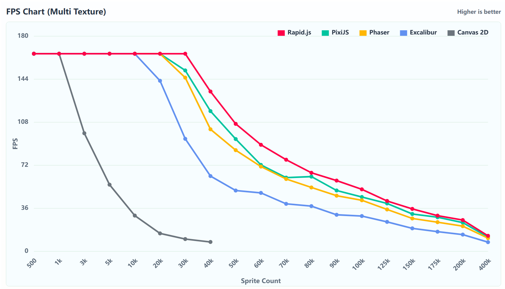

<p align="center">
  
</p>

<p align="center">
  <a href="https://www.npmjs.com/package/rapid-render"></a>
  <a href="https://www.npmjs.com/package/rapid-render"></a>
  <a href="https://github.com/Nightre/Rapid.js/blob/main/LICENSE"></a>
  
</p>

<p align="center">
  An immediate-mode, high-performance WebGL 2D renderer for browser games.
</p>

<p align="center">
  <a href="https://nightre.github.io/Rapid.js/">Website & Examples</a>
  |
  <a href="https://nightre.github.io/Rapid.js/docs.html">Docs</a>
  |
  <a href="https://nightre.github.io/Rapid.js/api/">API Reference</a>
  |
  <a href="https://www.npmjs.com/package/rapid-render">NPM</a>
</p>

---

## What is Rapid?

Rapid is a focused WebGL 2D rendering engine for games and visual tools.

If you want Pixi-level rendering without letting your renderer dictate how your game is organized, Rapid.js is for you!

## Full 2D Toolkit

Particles, Light & Shadow, Custom Shaders, Lines, Masks, Render textures, Sprites, Custom Geometry, Filters and more. all from one focused WebGL renderer. Yet it is only **22.5 kB gzipped**.

## Install

```bash
npm install rapid-render
```

Or via the unpkg CDN

```html
<script src="https://unpkg.com/rapid-render/dist/rapid-render.umd.cjs"></script>
```

## Quick Start

```ts
import { Rapid } from "rapid-render";

const canvas = document.querySelector("canvas")!;
const rapid = new Rapid({canvas});
const texture = await rapid.texture.load("./image/sprite.png")

rapid.clear();
rapid.drawSprite({
    texture: texture,
    x: 40,
    y: 40,
});
rapid.flush();
```

## Render a scene

`rapid.matrixStack` brings the familiar, intuitive `save()` and `restore()` flow from Canvas 2D into high-performance WebGL. It reuses typed-array-backed matrix storage and avoids per-transform matrix allocation.

```ts
// root
// ├── world
// │   ├── player
// │   └── enemies
// │       ├── enemy #0
// │       ├── enemy #1
// │       └── ...
// └── ui

const stack = rapid.matrixStack;
// 1.root
stack.save();
    stack.translate(0, 0);
    // 2.world
    stack.save();
        rapid.drawSprite(player); // player
        // 3.enemies
        stack.save();
            for (let i = 0; i < 2; i++) {
                stack.save();
                    stack.translate(enemyX[i], enemyY[i]);
                    rapid.drawSprite(enemies[i]); // enemy
                stack.restore();
            }
        stack.restore(); // 3.enemies
    stack.restore(); // 2.world
stack.restore(); // 1.root
// ui
rapid.drawSprite(ui);
```

## Reuse MatrixStack Transforms

`save()` returns `parent`, `local`, and `world` matrix IDs. Saved world IDs can be used with `customMatrix` within the current frame. Use `retainMatrix()` to cache transforms across frames and reuse them with `save(cached)` or `cached.world`:

```ts
const stack = rapid.matrixStack;
const matrix = rapid.matrix;

const cached = stack.retainMatrix(stack.save());
matrix.translate(cached.local, 100, 80);
matrix.multiplyOut(cached.world, cached.parent, cached.local);
stack.restore();

function drawFrame() {
  rapid.clear();
  stack.save(cached);
  rapid.drawSprite({ texture });
  stack.restore();
  rapid.drawSprite({ texture, customMatrix: cached.world });
  rapid.flush();
}
```

`save()` accepts a saved state or individual matrix IDs:

```ts
stack.save();                            // Identity local; inherit parent world.
stack.save(cached);                      // Reuse the saved world and local IDs.
stack.save(cached.world, cached.local);  // Pass both IDs explicitly.
stack.save(cached.world);                // Create an identity local.
stack.save(undefined, cached.local);     // Calculate world = parent world * local.
```

Matrices retained with `stack.retainMatrix()` or created with `rapid.matrix.alloc()` are managed by you. Release them when no longer needed:

```ts
rapid.matrix.free(cached);

const m = rapid.matrix.alloc();
rapid.matrix.free(m);
```

For more information about matrix transformations, see the [Transformations](https://nightre.github.io/Rapid.js/docs.html#transformations).

## Benchmark

Performance Comparison: Rapid vs. Other Renderers and Game Engines

<p align="center">
  <a href="https://nightre.github.io/Rapid.js/benchmark/">
    
  </a>
</p>

[Run Interactive Benchmark Live](https://nightre.github.io/Rapid.js/benchmark/)

Tested on **Windows 11 / Intel i7-12850H / NVIDIA RTX 4070 Laptop GPU / Google Chrome (WebGL 2.0)**

## Who is using Rapid.js?

We'd love to feature your work! Please [**Submit a Pull Request**](https://github.com/Nightre/Rapid.js/pulls) or tell nightscratch1145@gmail.com to add your game or app to the showcase!
<table>
  <tr>
    <td width="96" valign="top">
      <a href="https://www.instagram.com/p/DJboaWgMzhK/?img_index=3">
        
      </a>
    </td>
    <td valign="top">
      <strong><a href="https://www.instagram.com/p/DJboaWgMzhK/?img_index=3">Avoid the Zeros</a> by Foxdog Studios</strong><br>
      Foxdog Studios used Rapid.js to deliver fast download times and smooth multi-sprite rendering for thousands of audience members playing simultaneously on their mobile phones at the <strong>Sydney Opera House</strong>.<br>
    </td>
  </tr>
  <tr>
    <td width="96" valign="top">
      <a href="https://poki.com/zh/g/emoji-party">
        
      </a>
    </td>
    <td valign="top">
      <strong><a href="https://poki.com/zh/g/emoji-party">Emoji Party</a> by illusivegames</strong><br>      
      A featured puzzle hit on Poki, surpassing <strong>6 million plays</strong>. Rapid.js powers its smooth rendering and instant-play experience across hundreds of thousands of diverse mobile and desktop browser environments.<br>
    </td>
  </tr>
</table>

## Contributing

Contributions, issues, and feature requests are welcome!

Before submitting a Pull Request, please ensure:
- **Strict TypeScript (Zero any)**: All code must pass strict type checking with zero `any`, loose casts, or `@ts-ignore` directives.
- **Passing Checks**: Run `npm run build` to ensure clean compilation with zero warnings or errors.
