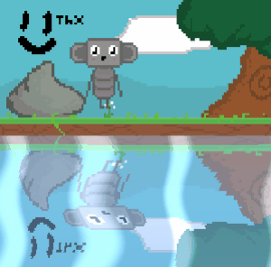

> [!WARNING]
> **🚧 Major Refactoring in Progress 🚧**
>
> This project is currently undergoing a significant rewrite to improve its core architecture and introduce new features. As a result, the **current documentation and examples are outdated** and may not work with the `main` branch.
>
> We are working hard to update the documentation soon. Thank you for your patience!

# Rapid.js

A highly efficient ([stress-test](https://nightre.github.io/Rapid.js/docs/examples.html)) and lightweight WebGL-based 2D rendering engine focused on rendering capabilities.

### [Website](https://nightre.github.io/Rapid.js/docs/index.html)

#### [Document](https://nightre.github.io/Rapid.js/docs/docs.html) | [API Docs](https://nightre.github.io/Rapid.js/docs/api/index.html) | [Examples](https://nightre.github.io/Rapid.js/docs/examples.html)

## Features

* **Fast Rendering** ⚡
* **TileMap** - YSort, isometric 🗺️
* **Light Shadow** 💡
* **Particle** 🎆
* **Camera** 🎥
* **Graphics Drawing** ✏️
* **Text Rendering** 📝
* **Line Drawing** - line texture 〰️
* **Custom Shaders** 🎨
* **Mask** 🎭
* **Frame Buffer Object** 🖼️

## Performance Testing

32x32 Texture Sprites 60FPS

* `Intel® Iris® Xe Graphics` : 42K sprites

## Install

```bash
npm i rapid-render
```

Or via CDN:

```html
<script src="https://unpkg.com/rapid-render/dist/rapid.umd.cjs"></script>
```

## Quick Start

```js
import { Rapid, Color, Vec2 } from "rapid-render"

// Initialize
const rapid = new Rapid({
    canvas: document.getElementById("gameCanvas"),
    backgroundColor: Color.fromHex("E6F0FF")
})

// Render example
rapid.render(() => {
    rapid.renderRect({ 
        offset: new Vec2(100, 100), 
        width: 50, 
        height: 50, 
        color: Color.Red 
    })
})
```

For more examples and detailed documentation, visit our [website](https://nightre.github.io/Rapid.js/docs/index.html).

## Roadmap

* 9-slice 🚧 (In Progress)
* Nodejs Support

## Contributing

Issues and PRs are welcome!

## Screen shot





